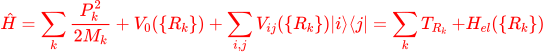
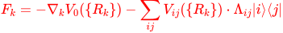
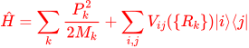
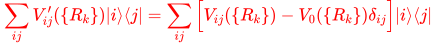

# Code for Performing Semi-Classical Quantum Dynamics
The methods that are implimented in this code are : PLDM (Parital Linearized Density Matrix), spin-PLDM, MFE (Mean-Field Ehrenfest), various SQC (Symmetric Quasi-Classical Approach) and N-RPMD (Nonadiabatic Ring-Polymer Molecular Dynamics). The present code works for slurm based High-Performance Computing Cluster (HPCC), HTcondor based High-Throughput Computing (HTC) as well as on personal computers.  

# Usage  
### Step 1
Create a folder and git clone this repository.
```
git clone https://github.com/arkajitmandal/SemiClassical-NAMD
```
### Step 2
Code up the model system in a python file inside the "Model" folder and name it  'modelName.py'.  

The 'modelName.py' should look like:
```py
import numpy as np

class parameters():
   # some parameters
   # Nuclear Timestep (a.u.)
   dtN = 2

   # Number of Nuclear Steps 
   # length of simulation : dtN x Nsteps
   NSteps = 600  
   
   # Number trajectories per cpu
   NTraj = 100

   # Electronic Timestep (a.u.)
   # Please use even number
   dtE = dtN/40

   # Mass of nuclear particles in a.u.
   # is a vector of length NR : number 
   # of nuclear DOF
   M = np.array([1836.0])

   # Initial electronic state
   initState = 0
   
   # Save data every nskip steps
   nskip = 5

def Hel(R):
    # Diabatic potential energies Vij(R) in a.u., 
    # return Vij(R) : NxN Matrix 
    # (N  = number of electronic states)
    # R : Vector of length NR
    # (NR = number of nuclear degrees of freedom)
    # See details below 
    return Vij

def dHel0(R):
    # State independent gradient 
    # return dV0(R) : Vector of length NR
    # (NR = number of nuclear degrees of freedom) 
    # See details below
    return dV0

def dHel(R):
    # Gradient of the diabatic
    # potential energy matrix elements
    # Vij(R) in a.u.  
    # return dVij(R) : Array of dimention (N x N x NR)
    # See details below
    return dVij

def initR():
    # Provide initial values of R, P in a.u.
    # R, P : Both are vectors of length NR
    # (NR = number of nuclear degrees of freedom) 
    # See details below
    return R, P

def initHel0(R):
    #------ This part will be only for NRPMD----------
    #-------while running condensed phase system------
    #R : is a 2D array of dimensionality ndof,nb
         #where, nb is the bead and ndof is the number of dofs
    #M : mass of the particle
    #ω = frequency of the particle
    #R0 = initial positon of the photo-excitation 
    # see details below
    return  np.sum(0.5 *M* ω**2 * (R-R0)**2.0)
```

You can find several examples of model files inside the "Model" folder. I will explain each parts of this file in more detain in a section below.


### Step 3 (simple | serial; on your pc/mac/linux)
Prepare an input file (name it : 'whateverInput.txt'):
```
Model                = tully2
Method               = pldm-focused 
```

* Model : The right hand side of the first line, _tully2_, tells the code to look for tully2.py inside the folder "Model". If you name your model file as  modelName.py then you should write 'Model = modelName' (without the '.py' part). 
* Method : Written as, method-methodOption. Select a quantum dynamics method. The available methods are :
  - **mfe** : Mean-Field Ehrenfest Approach. Kind of worst approach you can think of.
   - **pldm-focused** : Partial Linearized Density Matrix (PLDM) [1] with focused initial conditions. Should be similar to mfe. Maybe slightly better. 
   - **pldm-sampled** : Partial Linearized Density Matrix (PLDM) [1] with sampled initial conditions or the original PLDM approach. Most of the time works well, sometimes does not. Very good if your potentials are Hermonic (like Spin-Boson systems)
   - **spinpldm-all**: The Spin-Mapping PLDM [2] approach with full sampling. Often better than PLDM. Reliable but slighly slow. If your initial electronic state is a pure state |i⟩⟨i| (you could start from a super position state, but you have to hack into this code to do that) use spinpldm-half to get the same result but much faster (by half).
   - **spinpldm-half**: The Spin-Mapping PLDM approach, but with our in-house approximation. Works perfectly if starting with an initial electronic state that is a pure state |i⟩⟨i| (you could start from a super position state, but you have to hack into this code to do that). 
   - **spinpldm-focused**: The Spin-Mapping PLDM approach, approximated. Good for short-time calculation and to get a general trend for longer time. 
   - **sqc-square**: The Symmetric Quasi-Classical Approach, with square window [3]. Better than MFE. Cannot use it for more than several electronic states.  
   - **sqc-triangle**: The Symmetric Quasi-Classical Approach, with triangle window [4]. Better than sqc-square.   
   - **zpesqc-triangle**: The zero-point energy corrected Symmetric Quasi-Classical Approach [5], with triangle window. As good as spin-PLDM or better.  
   - **zpesqc-square**: The zero-point energy corrected Symmetric Quasi-Classical Approach [5], with square window. Slightly worse than zpesqc-triangle.
   - **spinlsc**: Spin-LSC approach, sort of simpler version of Spin-PLDM. I think this is actually a great method. 

   - **nrpmd-n** : The non-adiabatic ring polymer molecular dynamics[6,7] framework for aims to captures nuclear quantum effects while predicting efficient short-time and reliable longer time
   dynamics. Reasonable results for electron/charge transfer dynamics. Here n represents the number of beads, i.e. nrpmd-5 means each nuclear degrees of freedom is described with 5 ring-polymer beads.  

The output file containing population dynamics is 'method-methodOption-modelName.txt', for the above input file it would be: 

_pldm-focused-tully2.txt_

### Step 3 (advanced | parallel jobs; slurm on HPCC) 
Prepare an input file (name it : 'whateverInput.txt') for slurm submission in your computing cluster:
```
Model                = tully2
Method               = pldm-focused 

System               = slurm
Nodes                = 2
Cpus                 = 24
Partition            = action    
```
For first two lines see previous section. 

Last four lines provide additional commands for slurm submission. For adding additional slurm ('#SBATCH') command, add them in the preamble of the 'parallel.py'. The default preamble looks like:
```py
#!/usr/bin/env python
#SBATCH -o output.log
#SBATCH -t 1:00:00
```
Please dont add lines like "#SBATCH -N 1" or 
"#SBATCH --ntasks-per-node=24" in the preamble as they are declared in the input file. 


The output file containing population dynamics is 'method-methodOption-modelName.txt', for the above input file it would be: 

_pldm-focused-tully2.txt_

### Step 3 (advanced | parallel jobs; htcondor on HTC) 
Prepare an input file (name it : 'whateverInput.txt') for slurm submission in your computing cluster:
```
Model                = morse1
Method               = mfe

System               = htcondor
Cpus                 = 10
pylocation           = /location/to/my_env.tar.gz
```
For first two lines described the model and method. 

Last three lines provide additional commands for htcondor submission. Note that for HTC one needs to create a image of a virtual environment. For details refer to : https://support.opensciencegrid.org/support/solutions/articles/12000058785-run-python-scripts-on-osg 

In short, create a virtual environment, install numpy and zip enviroment, like this:
```
$ module load python/3.7.0
$ python3 -m venv my_env
$ source my_env/bin/activate
$ pip install numpy
$ deactivate
$ tar czf my_env.tar.gz my_env
```

In last line my_env.tar.gz is created. Write the location of this zip in the last line of the input,
```
pylocation           = /location/to/my_env.tar.gz
```
After all jobs are done, run the following python script to get the output file. 
```
$ python avg.py
```

The output file containing population dynamics is 'method-methodOption-modelName.txt', for the above input file it would be: 

_mfe-morse1.txt_


### Step 4 

Run the this code with python3. 

```
python3 run.py whateverInput.txt
```
Where 'whateverInput.txt' is the input file described above.
If your inputfile is named 'input.txt' then you could also just run,
```
python3 run.py
```

# Details of Model Hamiltonian
In all of the approaches coded up here, the nuclear DOF __{R,P}__ are evolved classically (their equation motion evolves under a classical like force) and the electronic DOF are described with the diabatic electronic states __{|i⟩}__.  

A molecular Hamiltonian in the diabatic representation is written as:



where __P<sub>k</sub>__ is the momentum for the __k__ th nuclear degrees of freedom with mass __M<sub>k</sub>__. Further, __V<sub>0</sub>(\{R<sub>k</sub>})__  and  __V<sub>ij</sub>(\{R<sub>k</sub>})__ are the state-independent and state-dependent part of the electronic Hamiltonian __H<sub>el</sub>(\{R<sub>k</sub>})__ in the diabatic basis __{|i⟩}__. That is:  __⟨i| Ĥ - ∑<sub>k</sub> P<sup>2</sup><sub>k</sub>/2M<sub>k</sub> |j⟩ = V<sub>ij</sub>({R<sub>k</sub>}) + V<sub>0</sub>(\{R<sub>k</sub>})δ<sub>ij</sub>__. Of course most of times, we wave our hands, and make up models that describe __V<sub>ij</sub>({R<sub>k</sub>})__ with some analytical functions of __{R<sub>k</sub>}__. If you know the analytical form of __V<sub>ij</sub>({R<sub>k</sub>})__ you can write a model file: modelName.py. 


One can always, set __V<sub>0</sub>(\{R<sub>k</sub>})__ = 0, and instead redefine __V<sub>ij</sub>(\{R<sub>k</sub>}) ⟶ V<sub>ij</sub>(\{R<sub>k</sub>}) + V<sub>0</sub>(\{R<sub>k</sub>})δ<sub>ij</sub>__ and they should be equivalent in principle. However, some of the semiclassical approaches (**pldm-sampled**, **sqc-square** and **sqc-triangle**) produce results that depend on how one separates the state-independent and state-dependent parts of the gradient of the electronic Hamiltonian. This is because, this separation provides state dependent and independent gradients : __∇<sub>k</sub>V<sub>0</sub>(\{R<sub>k</sub>})__  and __∇<sub>k</sub>V<sub>ij</sub>(\{R<sub>k</sub>})__ which will provide different forces on nuclear particle for different choices of separations in some of these approximate quantum dynamics approaches. The nuclear forces computed in all of these approaches assumes this general form:



where Λ<sub>ij</sub> vaguely resembles the electornic density matrix elements. For example, in MFE, Λ<sub>ij</sub> = c<sub>i</sub>*c<sub>j</sub>.  For methods that have ∑<sub>i</sub>Λ<sub>ii</sub> = 1 (like MFE) for individual trajectories this separation of state-dependent and independent does not matter. For other's as I said before, it does. In my experience, the more you can put in the independent part the better. 

When such separation is not aparent, one can separate state-independent and state-dependent parts in the following manner. Consider the following molecular Hamiltonian with no aparent state-independent part of the electronic Hamiltonian:



One can define a state-independent part as:


and consequently the new state-dependent part  (with matrix elements __V'<sub>ij</sub>(\{R<sub>k</sub>})__ ) becomes:



With this choice one gets the following state dependent and independent part of gradients: __∇<sub>k</sub>V<sub>0</sub>(\{R<sub>k</sub>})__  and __∇<sub>k</sub>V'<sub>ij</sub>(\{R<sub>k</sub>})__.


## Details of a model file ('modelName.py')

### Hel(R)
In the Hel(R) function inside the 'modelName.py' one have to define NxN matrix elements of the state-dependent electronic part of the Hamiltonian. Here you will code up  __V<sub>ij</sub>(\{R<sub>k</sub>})__.

### dHel(R)
In the dHel(R) function inside the 'modelName.py' one have to define NxNxNR matrix elements of the state-dependent gradient electronic part of the Hamiltonian. Here you will code up  __∇<sub>k</sub>V<sub>ij</sub>(\{R<sub>k</sub>})__.

### dHel0(R)
In the dHel0(R) function inside the 'modelName.py' one have to define a array of length NR describing the state-independent gradient of electronic part of the Hamiltonian. Here you will code up  __∇<sub>k</sub>V<sub>0</sub>(\{R<sub>k</sub>})__.


**_NOTE:_** You dont need to code up __V<sub>0</sub>(\{R<sub>k</sub>})__ as such a zero-point energy shift does not affect dynamics. 

### initR()
Sample R, P from a wigner distribution. 

_____________
_to be continued_...
<!--- 

For example consider a 1D dimentional model system, called the Tully's Model II. It has two electronic states and one nuclear DOF. Thus we write the Hamiltonian with one set of  $\{R,P\}$. _to be continued_...

[6] Braden, Mandal and Huo __J. Chem. Phys. 155, 084106__
-->
## References
_____________
[1] Huo and Coker __J. Chem. Phys. 135, 201101 (2011)__\
[2] Mannouch and Richardson __J. Chem. Phys. 153, 194109 (2020)__\
[3] Cotton and Miller __J. Chem. Phys. 139, 234112 (2013)__\
[4] Cotton and Miller __J. Chem. Phys. 145, 144108 (2016)__\
[5] Cotton and Miller __J. Chem. Phys. 150, 194110 (2019)__\
[6] S. N. Chowdhury and P.Huo __J. Chem. Phys. 147, 214109 (2017)__\
[7] S. N. Chowdhury and P.Huo __J. Chem. Phys. 150, 244102 (2019)__


email: arkajitmandal@gmail.com